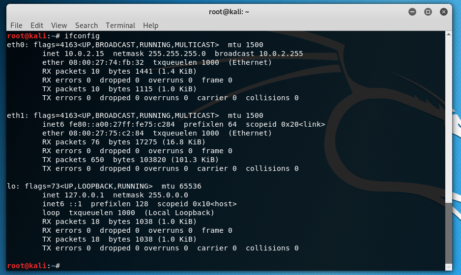
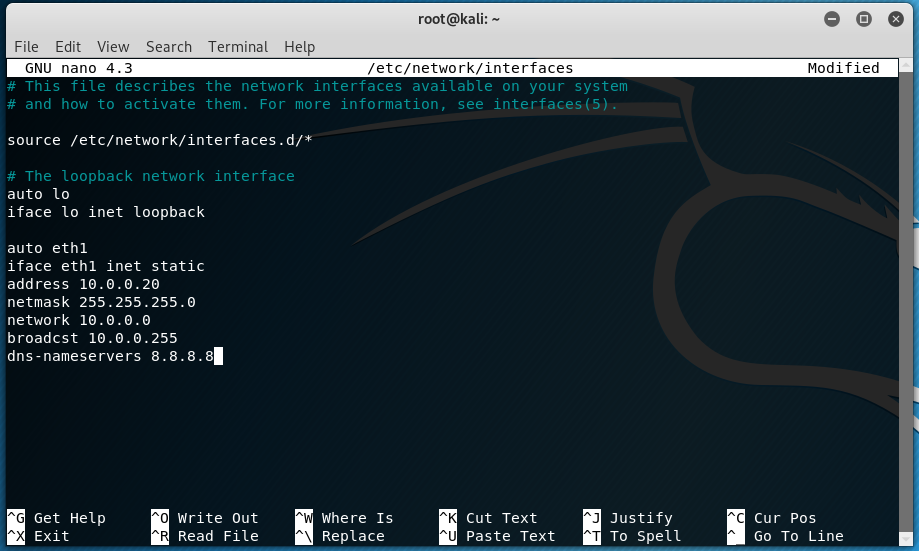
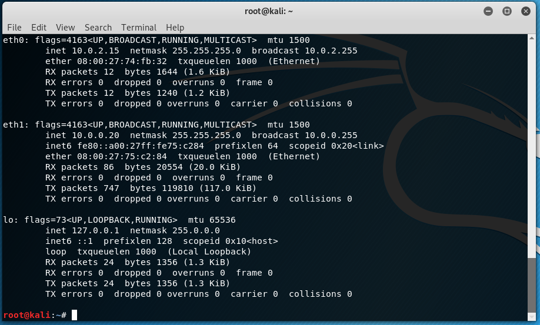

# Conectar el laboratorio
En este punto de la guía, ya deberias tener la máquina de metasploitable lista y configurada para el laboratorio según la guía y también tu máquina Kali preparada con sus dos interfaces de red.

Si no, pásate por aca:
* Kali Linux - [Guía de instalación Kali Linux](INSTALL_KALI.MD)
* Metasploitable v2 - [Guía de instalación Metasploitable](INSTALL_METASPLOITABLE.MD)

# Resumen del laboratorio
Si seguiste ambas guías vas a tener la siguiente estructura:


Sin embargo, no hemos configurado aún la dirección estática del ``eth1`` dentro de la red. Así que iniciando sesión en nuestra máquina Kali (que según la guía tiene dos interfaces de red). Y escribiendo el comando ``ifconfig`` deberias ver lo siguiente:



En la imagen fíjate que aparecen 3 interfaces: ``eth0``, ``eth1`` y ``lo``. Si tan solo te aparece **eth0** y **lo** es por que no has habilitado la segunda interfaz. En la configuración de tu máquina virtual Kali, habilita ``Adaptador 2`` y seleciona la opción **Red Interna** y dejalo linkeado a la intnet


Si te pierdes sigue el paso **Paso 5: Configurar la red** de la [Guía de instalación Kali Linux](INSTALL_KALI.MD).

Volviendo a la Máquina Kali, vamos a configurar la interfaz estática, tal como lo hicimos en la máquina Metasploitable.

```bash
sudo nano /etc/network/interfaces
```

Dentro de este archivo, necesitamos editar desde la línea ``iface lo inet loopback`` hacia abajo, reemplazandolo por lo siguiente:

```bash
auto eth1
iface eth1 inet static
address 10.0.0.20
netmask 255.255.255.0
network 10.0.0.0
broadcst 10.0.0.255
dns-nameservers 8.8.8.8
```

Debería quedar así.



Presionar ``CTRL + X`` y guardar los cambios. Ahora que establecimos la dirección estática, necesitamos reiniciar el adaptador de red.
```bash
/etc/init.d/networking restart
```



Ahora es necesario agregar la ruta para tener acceso y deberiamos poder pingear la otra máquina.

# Probar conectividad entre las máquinas
La máquina Kali deberia ahora poder tener acceso a la máquina metasploitable (debe estar encendida, es como obvio pero uno nunca sabe).