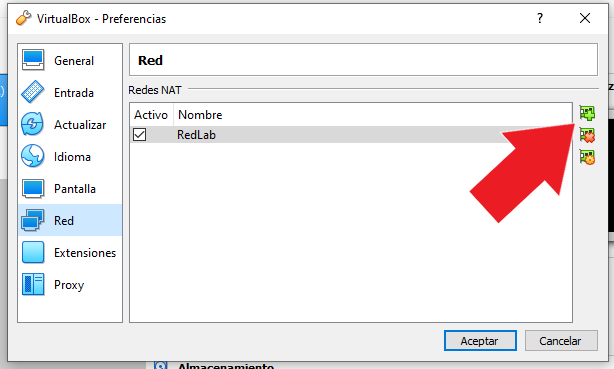
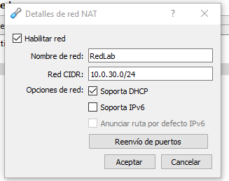

# Creacion de red de laboratorio
Para que las máquinas dentro de nuestra red de laboratorio puedan verse, es necesario colocarlas dentro de una misma red. Para ello es necesario abrir Virtualbox y seleccionar arriba **Archivo > Preferencias** y apretar el boton con el símbolo más.

Esto creará automáticamente una red llamada NatNetwork. Selecionala y haz doble click para editarla y configurala de la siguiente forma
* **Nombre de red:** RedLab
* **Red CIDR:** 10.0.30.0/24
* **Opciones de red:** Soporta DHCP (Check)

Presiona aceptar y estará listo nuestro entorno privado para las máquinas.

