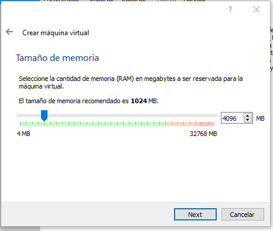
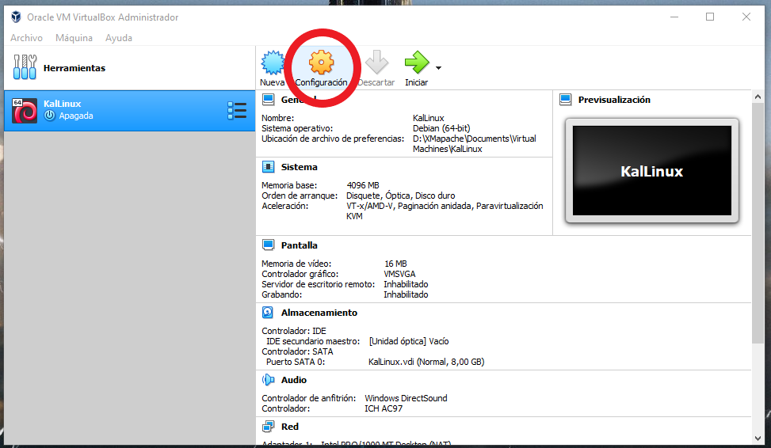
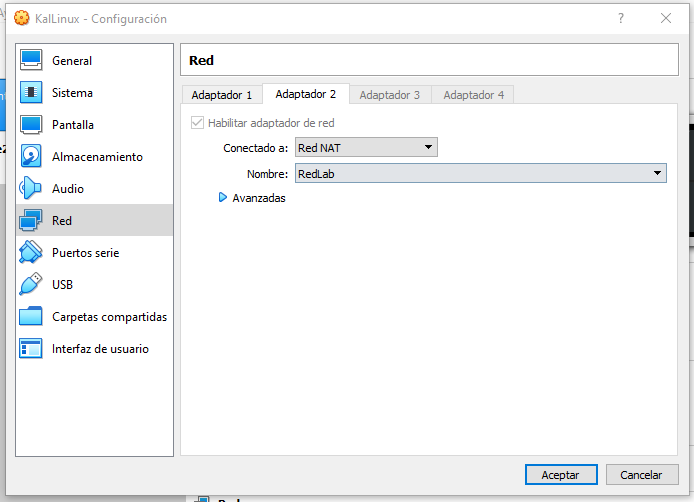

# Instalacion Kali Linux
Lo primero que debemos hacer es instalar Kali linux para el taller. Para ello tenemos dos opciones, descargar el OVA e importarla en Virtualbox (O VMWare Player) o instalar nuestra propia máquina Virtual. Para esta guia usaremos Virtualbox y la imagen para realizar la instalación. ¡Es bastante fácil! ya verás.

Personalmente no recomiendo usar la OVA ya que viene con demasiadas opciones por defecto, aparte que la experiencia de instalar una máquina virtual también es importante como parte del proceso de aprendizaje.

Si estas muy complicado, la puedes descargar desde aquí:


## Paso 1: Descargar lo necesario.
El virtualizador VirtualBox (ninguna preferencia en particular):
* **[Descargar VirtualBox](https://www.virtualbox.org/wiki/Downloads)**: Seleciona la opción que te sirva, Windows, OSx u Linux.

Ahora, a descargar la imagen de Kali Linux:
* **[Descargar Kali Linux 32bits](https://cdimage.kali.org/kali-2019.3/kali-linux-2019.3-i386.iso)**: Si usarás menos de 4gb de ram usa esta opción.
* **[Descargar Kali Linux 64bits](https://cdimage.kali.org/kali-2019.3/kali-linux-2019.3-amd64.iso)**: Si usarás más de 4gb de ram usa esta otra opción.

## Paso 2: Instalar la máquina virtual.
Primero tenemos que instalar VirtualBox. Dado que es una instalación bastante trivial no lo incluiré dentro de esta guía de preparación (es prácticamente siguiente > siguiente > siguiente > ...).

Una vez instalada, abrir VirtualBox


Hacer click en Nueva (Botón celeste) y elegir un nombre para la máquina. En Tipo seleciona ``Linux`` y Versión ``Debian (64-bit)`` (Ojo aquí! Si descargaste la versión de 32bits seleciona Debian 32-bits).


Elige cuanta RAM puedes disponibe, ojalá coloca 8GB, pero si tu PC no tiene tanta RAM disponible usa como mínimo 2GB, yo utilizaré 4GB. **Una nota importante!, para este taller necesitamos virtualizar otra máquina, asi que no gastes toda tu RAM en Kali.**



Ahora toca crear un disco duro virtual. Ya que el taller es simple, no será necesaria tanta configuración especial para nuestra máquina. De todas formas sientete libre de configurar el disco que te guste. El por defecto (*Crear un disco duro virtual ahora*) es suficiente. Tan solo asegurate de colocar al menos 20gb.

Este disco duro tiene almancenamiento dinámico hasta el tamaño que elijas, es decir, si le pones 100GB no utilizará todo el espacio inmediatamente en tu computador, si no que lo irá utilizando a medida que el "disco se llene".

Deja las opciones por defecto. VDI > Reservado dinámicamente > Ubicación del disco > Finalizar.

Con esto queda creada nuestra máquina virtual (aún no tiene Kali instalado!). Vamos a configurarla. Seleciona la máquina y click en Configuración (la rueda dentada naranja).



## Paso 3: Configuraciones básicas
* **Opción General > (tab) Avanzado:** Habilitar ``Compartir portapapeles`` y ``Arrastrar y soltar`` en Bidireccional.
* **Opción Sistema > (tab) Placa base:** Revisar la RAM que esté en orden.
* **Opción Sistema > (tab) Procesador:** Asignar más procesadores si puedes! Si no, con uno bastará.
* **Opción Pantalla > (tab) Pantalla:** Asignar más memoria de video si puedes! Y activar la ``Habilitar aceleración 3D``.
* **Opción Almacenamiento:** La configuraremos después!
* **Opción Audio:** Deshabilitar el audio (no es necesario.)
* **Opción Red:** La configuraremos después!

El resto dejar como está.

## Paso 4: Configuración de almacenamiento
Al igual que en un computador cualquiera, necesitamos "insertar el disco" de Kali Linux para la instalación. Para ello entraremos al tab de almacenamiento y agregaremos la ISO que descargamos en los pasos iniciales.

En la sección ``Controlador: IDE``, seleciona la opción que dice ``Vacío`` y presiona el *disco azul* de la derecha. Selecionar ``Seleccione archivo de disco óptico virtual...``


En el menu, selecionar la imagen de Kali que descargamos. Es posible que la foto no corresponda a la última versión, sin embargo, el proceso es similar.


Con eso, al momento de iniciar la máquina virtual, iniciará el proceso de instalación de Kali.

## Paso 5: Configurar la red
Para este laboratorio, usaremos la red interna de Virtualbox para la comunicación de las máquinas. Sin embargo, la máquina de Kali Linux necesita acceso a internet también (para poder descargar algunos paquetes en caso de ser necesario). Para ello, colocaremos dos tarjetas de red, una en formato NAT (para que tenga acceso a internet), y otra tarjeta con acceso a la red interna de VirtualBox llamada ``intnet``. Esta red solo puede ser visualizada por las máquinas virtuales, de esta forma protegeremos nuestro laboratorio de intrusos no deseados.

Para esto, ir a la sección **Opción Red**. El ``Adaptador 1`` lo dejaremos tal cual está. Iremos al segundo adaptador (``Adaptador 2``). Selecionaremos la opción ``Red Interna`` y dejaremos el nombre como ``intnet``.



Presiona aceptar y con esto ya está configurado!

## Paso 6: Instalación de Kali Linux
Para ello, una vez configurado iniciaremos la máquina virtual creada. Presiona la flecha verde: Iniciar.


Esto iniciará nuestra máquina virtual, tal como como si fuera un computador real. Cuando inicie el sistema operativo deberiamos ver la pantalla de booteo de Kali Linux. En ese menú seleciona ``Graphical install`` y presiona enter.


La instalación de Kali linux es bastante trivial, te recomiendo que en la parte del ``Keymap`` selecionar Latin American para no tener problemas con el teclado que usaremos.


La instalación va a realizar varias detecciones de dispositivos e instalar algunos archivos. En algun punto de la instalación te solicitará que indiques la tarjeta primaria de red, le diremos a Kali que utilice ``eth0``, la que es equivalente al Adaptador 1 configurada en modo NAT, la segunda tarjeta que aparece (eth1) corresponderá al Adaptador 2 que configuramos con acceso a la red interna.


A continuación la instalación realizará preguntas. Si quieres puedes realizar configuraciones personalizadas así como elegir el Hostname y el dominio. En un punto te pedirá la clave del acceso root. **Te recomiendo encarecidamente que escojas una buena contraseña!** kali por defecto no es un sistema operativo seguro, está diseñado para atacar, y si ocupas esta máquina virtual en competencias o evaluaciones en la vida real y usas las tipicas claves por defecto (asdf, toor, root, 1234) tu computador quedará susceptible a ataques.


Luego, preguntará por la Zona horaria. Selecciona la que más se ajuste a la tuya. Este paso no es extremadamente relevante.

Cuando llegue a la parte de la instalación de las particiones, simplemente selecciona la por defecto. Si estuvieras instalando el sistema operativo como algo base en tu pc te diria que utilices LVM encriptado, pero para este caso no será necesario. La opción **Guided - use entire disk** nos facilitará la vida.


Selecciona el único disco duro que tenemos disponible (SCSI3) y dale a continuar. Deja la opción por defecto que indica que use todos los archivos en la misma partición y luego seleciona **Finish partitioning and write changes to disk**. Cuando te pregunte si deseas realizar los cambios indicale que Sí (por defecto viene marcada la opción de No, debes cambiarla manualmente).


La instalación terminará de escribir archivos en el disco duro.


Cuando la instalación pregunta sobre el **Package manager** selecionar la ``Yes`` y continuar con la instalación hasta que pregunte por la instalación del grub.

Cuando llegue ese punto asegurate de selecionar el ``/dev/sda`` (disco duro principal), tal como muestra la foto.


Con esto finalizará la instalación de Kali Linux, seleciona **Continue**. Se reiniciará la máquina y tendremos disponible el sistema operativo!


Pero no está listo, necesitamos instalar el módulo de optimización **Guest Additions** aún.

## Paso 7: Instalación de Guest Additions
Iniciar sesión en Kali con las credenciales que configuramos en el paso anterior. Para instalar guest-additions (es un módulo que mejora la compatibilidad de la Máquina virtual con Virtualbox) es necesario abrir una consola en Kali.

En la consola necesitamos agregar al APT el repositorio de Kali, para ello, ejecutar el siguiente comando. **Nota:** Sí, hay que escribirlo ya que no podemos copiar y pegar, y es por esta razón que estamos instalando este módulo.

```bash
echo "deb http://http.kali.org/kali kali-rolling main non-free contrib" >> /etc/apt/sources.list
apt update
```


Ahora, actualizaremos el repo e instalaremos lo necesario y reiniciaremos el Pc. Durante esta instalación te preguntará una serie de cosas, deja las opciones por defecto, con eso deberia bastar.

```bash
apt update
apt install -y virtualbox-guest-x11
init 6 # reinicia el equipo
```

Ahora veremos que la máquina se reinició, sin embargo si agrandamos la pantalla se agrandará junto con la máquina virtual. Esto quiere decir que instalamos bien el módulo y nuestra máquina está lista para el laboratorio!

