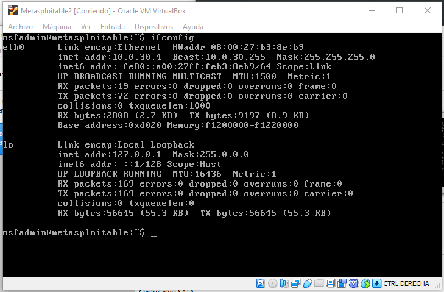

# Metasploitable
Metasploitable es una máquina virtual que está diseñada para recibir ataques. Tiene programas vulnerables y muchas -malas configuraciones- a propósito para que puedas probar tus habilidades. Si bien está en internet la documentación de cómo atacarla será utilizada para enseñar algunas técnicas en el taller.

Para este taller usaremos la máquina Metasploitable versión 2 (ya que la 3 ocupa otra tecnológia y complicaría de sobremanera el taller).

## Paso 1: Descargar lo necesario.
Como siempre, necesitas descargar la máquina para utilizarla. Te dejo los enlaces
* **[Descargar Metasploitable v2](http://downloads.metasploit.com/data/metasploitable/metasploitable-linux-2.0.0.zip)**: Es un archivo en formato Zip que pesa aproximadamente 825mb.

## Paso 2: Instalación de la máquina
La máquina viene preparada para Virtualbox, así que no es tan complicado. Descomprime el zip en una carpeta y te aparecerán 5 archivos, que representan la máquina.


Cada uno de estos archivos representa distitnas partes de la máquina. Principalmente el archivo de gran tamaño (con la cajita azul) representa el disco duro (con la extensión VMDK).

## Paso 3: Crear la máquina virtual
Necesitamos crear la máquina virtual de metasploitable! Pero esta es más facil que Kali por que el disco duro ya viene creado (el VMDK del paso anterior). Asi que tan solo es necesario crear el fierro alrededor de ese disco.

Para ello, crearemos una nueva máquina virtual


Hacer click en Nueva (Botón celeste) y elegir un nombre para la máquina. En Tipo seleciona ``Linux`` y Versión ``Ubuntu (64-bit)``.


Elige cuanta RAM le quieres asignar a la máquina. Como mínimo elije 1536 MB, pero si quieres ponerle más dale!


En la seleccion del disco duro, utilizaremos el que descargamos, para ello es necesario elegir la opción "Usar un archivo de disco duro virtual existente" y darle al ícono de la carpeta.


En la parte superior, presiona el botón **Agregar** y seleciona el VMDK que descomprimimos.


Luego termina de crear la máquina.

## Paso 4: Configurar la máquina virtual
Al igual que en en la máquina virtual de Kali, vamos a especificar que la tarjeta de red que utilizará será la de uso interno. Para ello selecionar la máquina recién creada y presiona el botón configuración.


Ir a la **Opcion Red > (tab) Adaptador 1** y selecionaremos la opción ``Red NAT`` y seleccionamos "RedLab". (Si no te aparece, revisa la guía de [Guía de creación de red laboratorio](CREAR_LABNET.MD)).


Guardar la configuración y ejecutar la máquina Virtual con el botón Iniciar.

La máquina comenzará a bootear todo lo necesario. Esperemos hasta que aparezca el prompt de login.


En este punto tenemos que logear en la máquina. Usa las siguientes credenciales por defecto para esta máquina:
* **Usuario:** msfadmin
* **Password:** msfadmin

Como esta sera nuestra máquina objetivo, saber que dirección IP nos asignó vía DHCP. Para ello lanzaremos el comando ``ifconfig`` y anotaremos la dirección IP en alguna parte.

```bash
ifconfig
```



En este caso asignó la dirección **10.0.30.4**, sin embargo es aleatorio. Anótala que servirá despues! Con esto la máquina queda lista para el laboratorio!