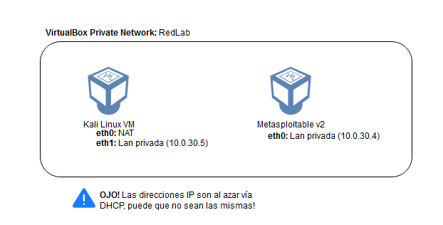

# IntroSEC - Taller 01
Este es un taller dedicado para alumnos de DUOC de Maipú (o cualquiera que quiera seguirlo) para introducirse en algunos aspectos de la ciberseguridad. El primer taller tiene por objetivo introducir al alumno en terminologías de sistemas, redes, computadores y servidores; al mismo tiempo utilizar algunas herramientas de hacking para analizarlas.

En este primer taller se verá:
 * **Masscan** - Herramienta de escaneo masivo, muy rápida y útil para un reconocimiento inicial
 * **NMap** - Herramienta para escanear puertos, servicios (y algunas vulnerabilidades).
 * **OpenVAS** - Herramienta opensource para analizar vulnerabilidades en sistemas.
 * **Exploits Scripts** - Utilización de algunos scripts para explotar algunas vulnerabilidades.
 * **Metasploit** - Framework de explotación (la usaremos en su modo más simple).

Para poder participar de este taller es necesario realizar un pre-laboratorio en el que se instalarán las máquinas virtuales necesarias para seguir el taller mientras se expone. Para realizar este taller es necesario realizar tres pasos:

* **Paso 1:** Creacion red Laboratorio - [Guía de creación de red laboratorio](CREAR_LABNET.MD)
* **Paso 2:** Kali Linux - [Guía de instalación Kali Linux](INSTALL_KALI.MD)
* **Paso 3:** Metasploitable v2 - [Guía de instalación Metasploitable](INSTALL_METASPLOITABLE.MD)

La arquitectura de red para este laboratorio es la siguiente:

Asegurandonos de seguir ambas guias al pie de la letra podremos tener nuestro laboratorio listo y preparado!